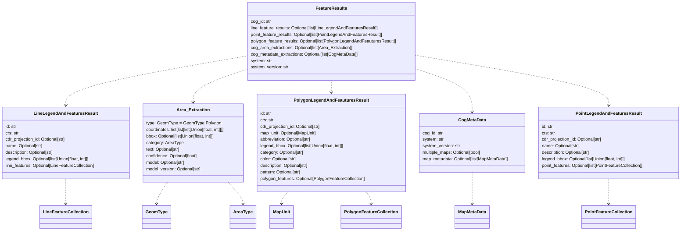
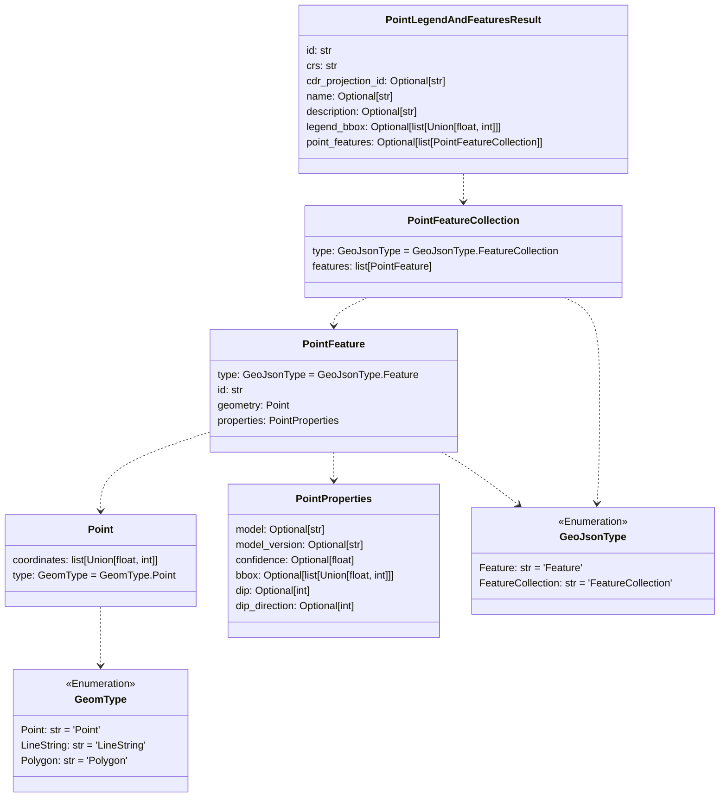
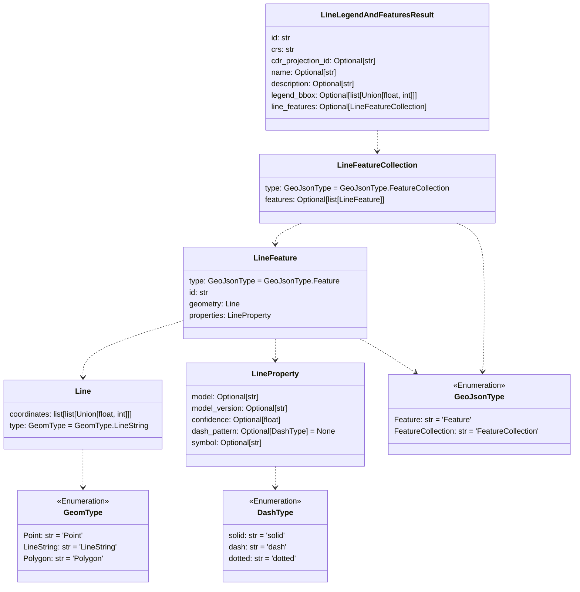
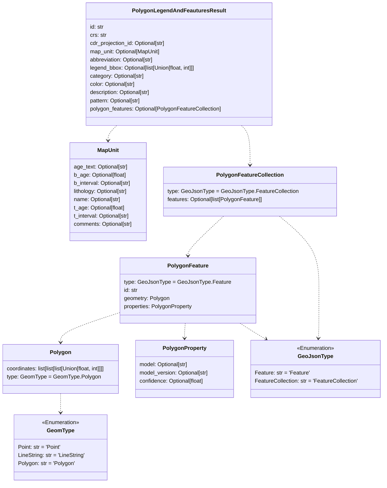
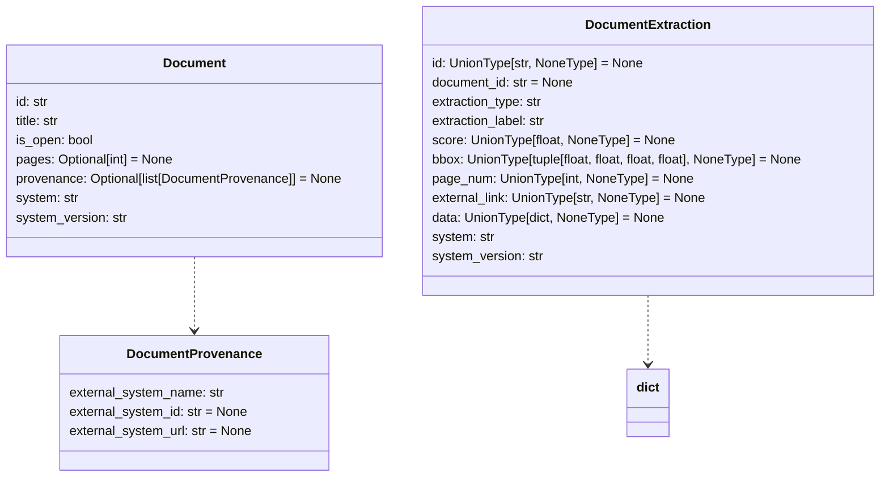
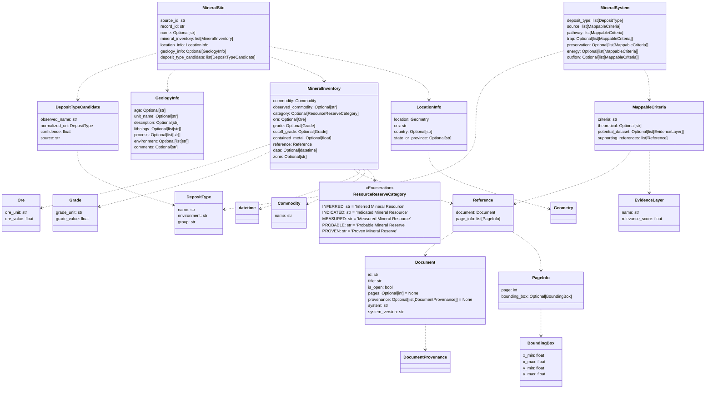
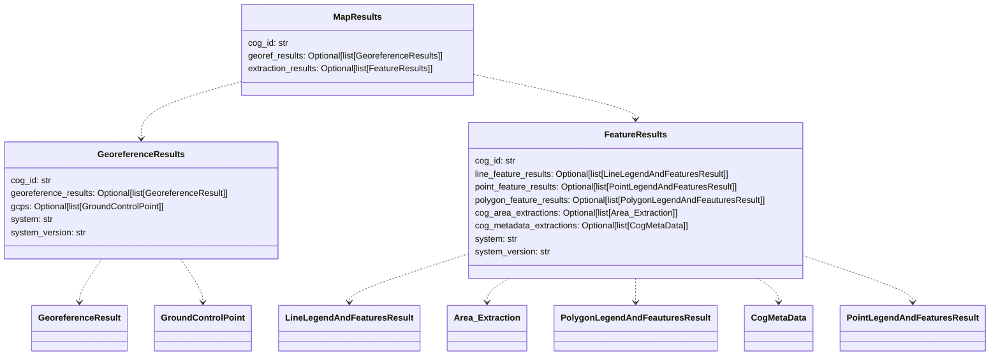

# CDR Schemas


## Development

Formatting Code
```
poetry run format
```


Verify Changes
```
# verify types (mypy)
poetry run types

# lint
poetry run lint
```

Build local package

```
poetry build -f sdist
```


Update Schema Diagrams

To generate schemas you will need to run `poetry install --with docs` to install the proper dependencies

```
poetry run docs
```

<!--#+BEGIN_SCHEMA-->
<!-- this sections is autogenerated -->

## Schemas


### Georeference

```mermaid
classDiagram

    class ProjectionResult {
        crs: str
        gcp_ids: list[str]
        file_name: str
    }

    class Pixel_Point {
        rows_from_top: Union[float, int]
        columns_from_left: Union[float, int]
        type: GeomType = GeomType.Point
    }

    class GeoreferenceResults {
        cog_id: str
        georeference_results: Optional[list[GeoreferenceResult]]
        gcps: Optional[list[GroundControlPoint]]
        system: str
        system_version: str
    }

    class GeoreferenceResult {
        likely_CRSs: Optional[list[str]]
        map_area: Optional[Area_Extraction]
        projections: Optional[list[ProjectionResult]]
    }

    class Geom_Point {
        latitude: Union[float, int, NoneType]
        longitude: Union[float, int, NoneType]
        type: GeomType = GeomType.Point
    }

    class GroundControlPoint {
        gcp_id: str
        map_geom: Geom_Point
        px_geom: Pixel_Point
        confidence: Optional[float]
        model: str
        model_version: str
        crs: Optional[str]
    }

    class GeomType {
        <<Enumeration>>
        Point: str = 'Point'
        LineString: str = 'LineString'
        Polygon: str = 'Polygon'
    }

    class Area_Extraction {
        type: GeomType = GeomType.Polygon
        coordinates: list[list[list[Union[float, int]]]]
        bbox: Optional[list[Union[float, int]]]
        category: AreaType
        text: Optional[str]
        confidence: Optional[float]
        model: Optional[str]
        model_version: Optional[str]
    }

    Area_Extraction ..> GeomType
    Area_Extraction ..> AreaType
    Geom_Point ..> GeomType
    Pixel_Point ..> GeomType
    GroundControlPoint ..> Pixel_Point
    GroundControlPoint ..> Geom_Point
    GeoreferenceResult ..> Area_Extraction
    GeoreferenceResult ..> ProjectionResult
    GeoreferenceResults ..> GeoreferenceResult
    GeoreferenceResults ..> GroundControlPoint


```

<details open>
    <summary>georeference</summary>



</details>

### Metadata

<details open>
    <summary>metadata</summary>


</details>

### Feature Results

<details open>
    <summary>feature results</summary>



</details>

### Point Feature

<details open>
    <summary>point feature</summary>



</details>

### Line Feature

<details open>
    <summary>line feature</summary>



</details>

### Polygon Feature

<details open>
    <summary>polygon feature</summary>



</details>

### Cog Metadata

<details open>
    <summary>cog metadata</summary>


</details>

### Document

<details open>
    <summary>document</summary>



</details>

### Mineral

<details open>
    <summary>mineral</summary>



</details>

### Map Results

<details open>
    <summary>map results</summary>



</details>

### Map

<details open>
    <summary>map</summary>


</details>
<!--#+END_SCHEMA-->
